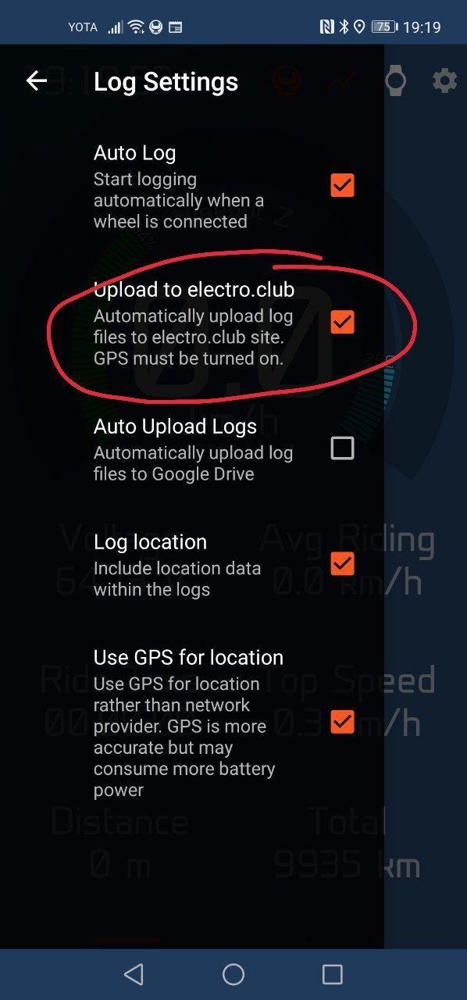
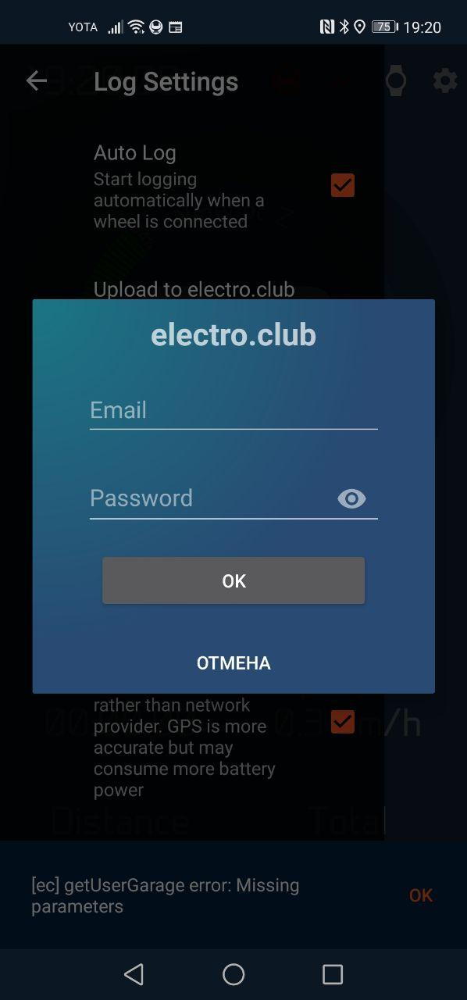
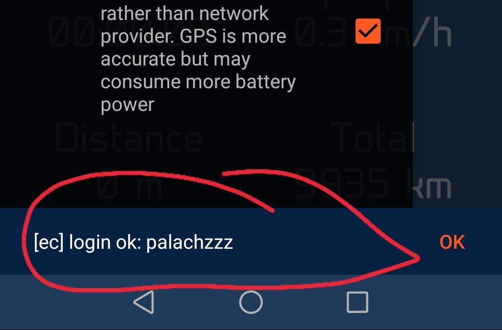
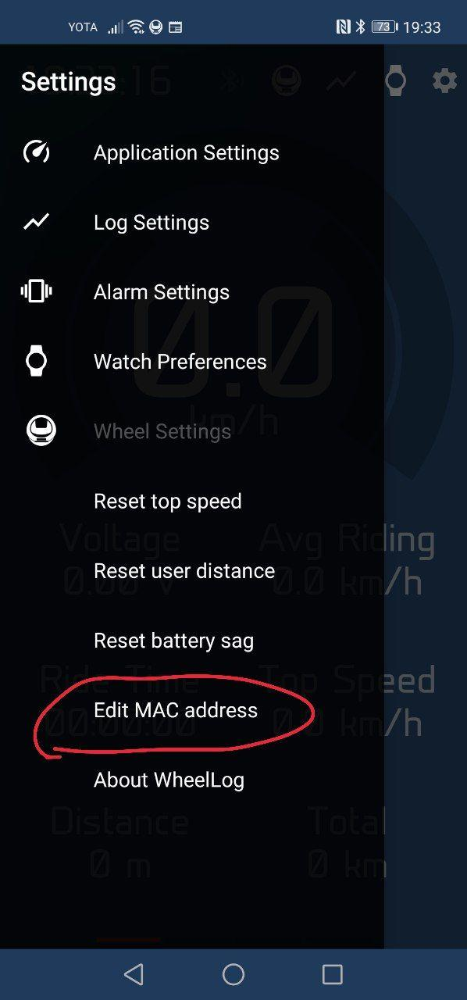
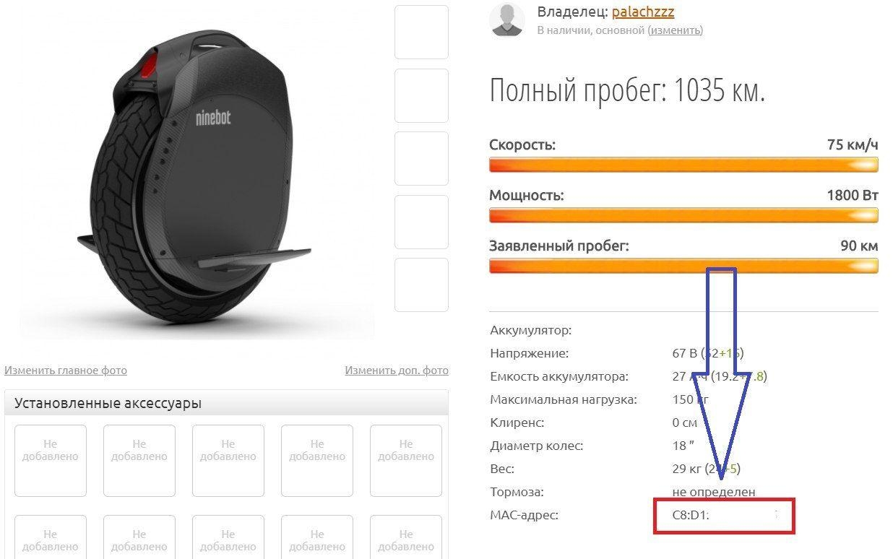

## electro.club

В последних версиях появилась возможность загружать треки на сайт [electro.club](https://electro.club).
Для этого нужно...

- зарегистрироваться на сайте [electro.club](https://electro.club)
- скачать бета версию Wheellog из [телеграм канала](https://t.me/wheellog)
- в настройках перейти в логирование
- установить галочку загрузки в electro.club

- ввести логин и пароль

- при успешном подключении будет выведен ваш ник

- проверить включен GPS, без него треки не принимаются

При завершении записи трека или при выходе из приложения трек будет загружен в [electro.club](https://electro.club).
Искать его можно в разделе карты в своем профиле. Чтобы он сразу загружался к конкретному транспорту, необходимо на [сайте](https://electro.club) установить для него MAC-адрес.

______

## Известные проблемы

- GPS не записываеся при выключеном экране
1. Проверьте что геопозиция включена в любом режиме
2. Если у вас телефон производства **Xiaomi** то необходимо отключить контроль активности приложения. Долгое нажатие на иконку - `О приложении` - `Контроль активности` - `Нет ограничений`

- TODO
